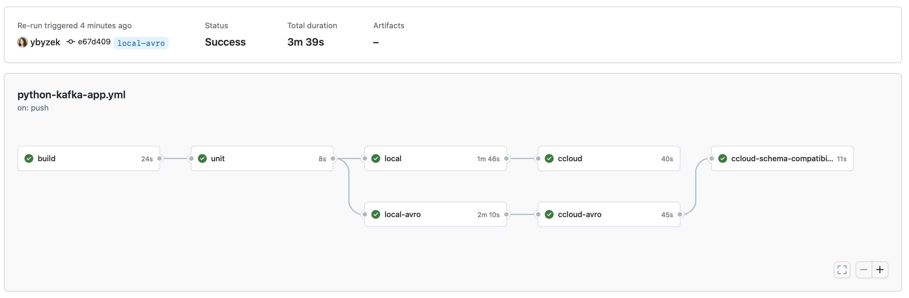
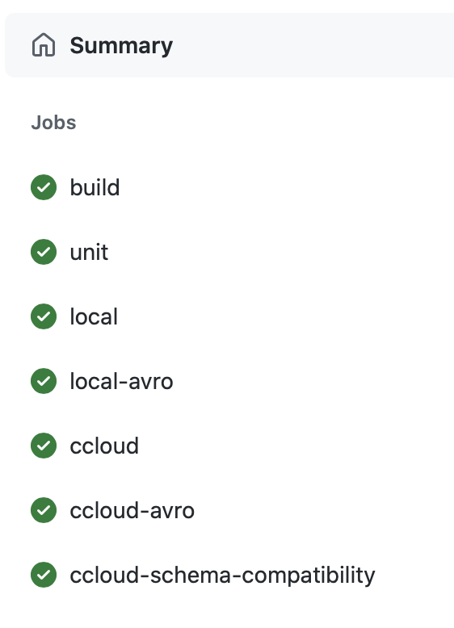

## Overview

This demo uses [GitHub Actions](https://docs.github.com/en/actions) for developing and valiating Apache Kafka client application, focusing on a Python producer and consumer using [Kafka Python Client](https://docs.confluent.io/kafka-clients/python/current/overview.html).

The code defines a [GitHub Actions workflow](.github/workflows/python-kafka-app.yml) to demonstrate a few capabilities:

- Build Docker image for the client application
- Unit test with [rdkafka mock](https://github.com/edenhill/librdkafka/blob/master/src/rdkafka_mock.h)
- Local test using an action to run [cp-all-in-one](https://docs.confluent.io/platform/current/tutorials/build-your-own-demos.html#cp-all-in-one)
- Local test with Schema Registry and Avro using an action to run [cp-all-in-one](https://docs.confluent.io/platform/current/tutorials/build-your-own-demos.html#cp-all-in-one)
- Confluent Cloud test
- Confluent Cloud test with Schema Registry and Avro
- Schema compatibility check



## Instructions

1. Provision a fully-managed Kafka cluster and Schema Registry on Confluent Cloud. You can follow the [quickstart](https://developer.confluent.io/quickstart/kafka-on-confluent-cloud/) or use [ccloud-stack](https://docs.confluent.io/platform/current/tutorials/examples/ccloud/docs/ccloud-stack.html) to programmatically create a stack of fully managed services in Confluent Cloud.

2. In your GitHub account, create [Encrypted Secrets](https://docs.github.com/en/actions/security-guides/encrypted-secrets) for your Confluent Cloud cluster:

```shell
# Confluent Cloud Kafka cluster
CONFLUENT_BOOTSTRAP_SERVERS
CONFLUENT_API_KEY
CONFLUENT_API_SECRET
# Confluent Cloud Schema Registry
CONFLUENT_SCHEMA_REGISTRY_URL
CONFLUENT_BASIC_AUTH_USER_INFO
```

3. Fork this repository and push a change to trigger the [workflow](.github/workflows/python-kafka-app.yml).


