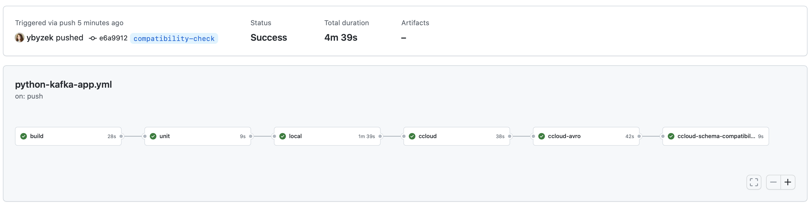

## Overview

This demo uses [GitHub Actions](https://docs.github.com/en/actions) for developing and valiating Apache Kafka client application, focusing on a Python producer and consumer using [Kafka Python Client](https://docs.confluent.io/kafka-clients/python/current/overview.html).

It has a workflow that tests in 4 stages:

- Unit test
- Local with Docker
- Confluent Cloud
- Confluent Cloud with Schema Registry




## Setup

1. Provision a fully-managed Kafka cluster and Schema Registry on [Confluent Cloud](https://www.confluent.io/confluent-cloud/tryfree-v1). You can do this on your own or use [ccloud-stack](https://docs.confluent.io/platform/current/tutorials/examples/ccloud/docs/ccloud-stack.html#ccloud-stack) to programmatically create a stack of fully managed services in Confluent Cloud.

2. In your GitHub account, create [Encrypted Secrets](https://docs.github.com/en/actions/security-guides/encrypted-secrets) for:

```shell
# Confluent Cloud Kafka cluster
CONFLUENT_BOOTSTRAP_SERVERS
CONFLUENT_API_KEY
CONFLUENT_API_SECRET
# Confluent Cloud Schema Registry
CONFLUENT_SCHEMA_REGISTRY_URL
CONFLUENT_BASIC_AUTH_USER_INFO
```

3. Clone this repository and push a change to see the [GitHub Actions workflow](.github/workflows/python-kafka-app.yml) in action.

## To do

- Convert docker runs to actions?
