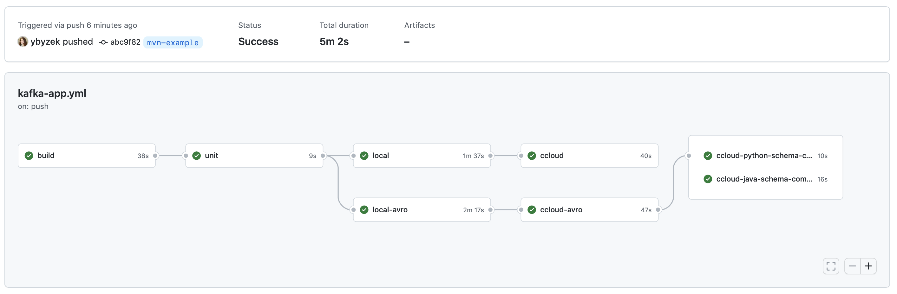

## README

* [Overview](#overview)
* [Instructions](#instructions)
* [Resources](#resources)

## Overview

This demo uses GitHub Actions for developing and valiating Apache Kafka client application, focusing on a Python producer and consumer using Kafka Python Client.

The code defines a GitHub Actions workflow called [python-kafka-app](.github/workflows/python-kafka-app.yml) with jobs to demonstrate a few capabilities:

- `build`: Build a Docker image for the [Kafka Python client application](src/)
- `unit`: Unit test the app with [rdkafka mock](https://github.com/edenhill/librdkafka/blob/master/src/rdkafka_mock.h)
- `local`: Locally test the app using an action called [cp-all-in-one](.github/actions/cp-all-in-one/) to run Confluent Platform from a [Docker Compose file](https://docs.confluent.io/platform/current/tutorials/build-your-own-demos.html#cp-all-in-one)
- `local-avro`: Locally test the app with Schema Registry and Avro using an action called [cp-all-in-one](.github/actions/cp-all-in-one/) to run Confluent Platform from a [Docker Compose file](https://docs.confluent.io/platform/current/tutorials/build-your-own-demos.html#cp-all-in-one)
- `ccloud`: Test the app to [Confluent Cloud](https://www.confluent.io/confluent-cloud/tryfree-v1/)
- `ccloud-avro`: Test the app to [Confluent Cloud](https://www.confluent.io/confluent-cloud/tryfree-v1/) with Confluent Cloud Schema Registry and Avro
- `ccloud-schema-compatibility`: Check a new schema's compatibility to the exist schema in Confluent Cloud Schema Registry


## Instructions

1. Provision a Kafka cluster and Schema Registry on [Confluent Cloud](https://www.confluent.io/confluent-cloud/tryfree-v1/), and create an API key and secret for the application. You can follow the [quickstart](https://developer.confluent.io/quickstart/kafka-on-confluent-cloud/) or use [ccloud-stack](https://docs.confluent.io/platform/current/tutorials/examples/ccloud/docs/ccloud-stack.html) to programmatically create a stack of fully managed services in Confluent Cloud.

2. In your GitHub account, create [Encrypted Secrets](https://docs.github.com/en/actions/security-guides/encrypted-secrets) for your Confluent Cloud cluster and credentials:

```shell
# Confluent Cloud Kafka cluster
CONFLUENT_BOOTSTRAP_SERVERS
CONFLUENT_API_KEY
CONFLUENT_API_SECRET
# Confluent Cloud Schema Registry
CONFLUENT_SCHEMA_REGISTRY_URL
CONFLUENT_BASIC_AUTH_USER_INFO
```

3. Fork this repository and push a change to trigger the [workflow](.github/workflows/python-kafka-app.yml).



## Resources

- [Confluent Cloud](https://www.confluent.io/confluent-cloud/tryfree-v1/): Cloud-native service for Apache Kafka
- [GitHub Actions for ksqlDB](https://github.com/jzaralim/ksqldb-migrations-action): demonstrates schema migrations upon a ksqlDB cluster running in Confluent Cloud
- [Kafka Python Client](https://docs.confluent.io/kafka-clients/python/current/overview.html)
- [GitHub Actions](https://docs.github.com/en/actions)
